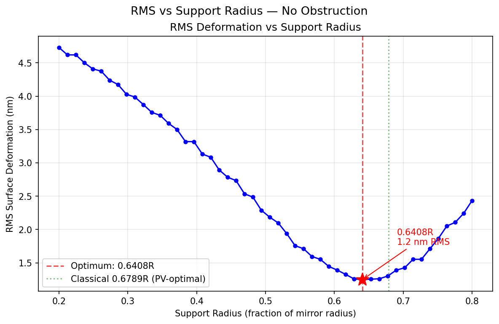
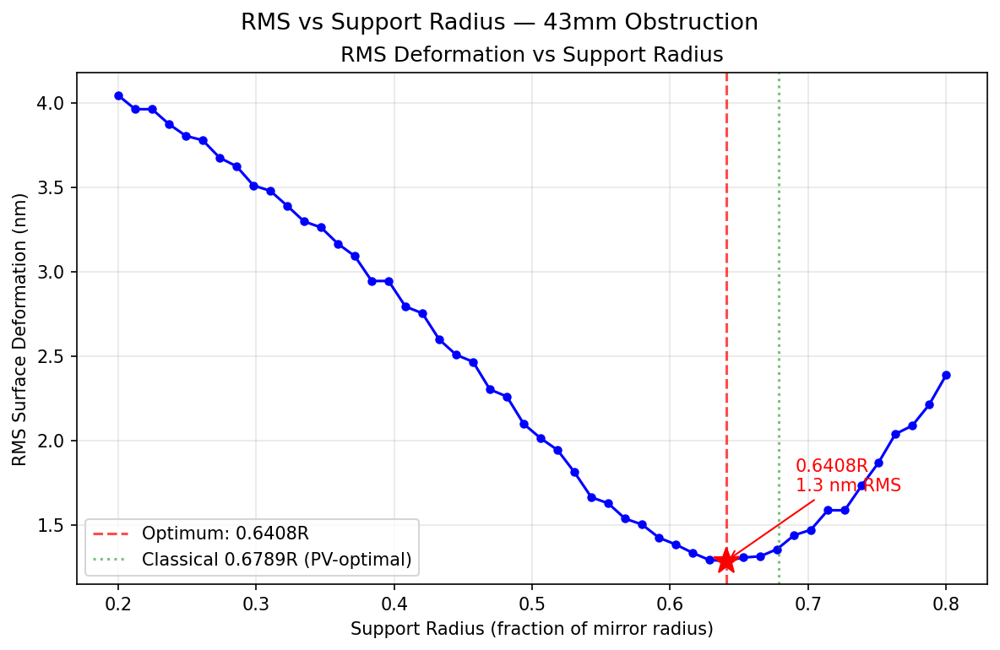

# Mirror Cell Support Optimizer

A free, open-source tool for amateur telescope makers to analyze and optimize the placement of three symmetric support points for a Newtonian telescope primary mirror. It uses finite element analysis to compute gravitational surface deformation and sweeps the support radius to find the placement that minimizes RMS wavefront error.

## How It Works

The mirror is modeled as a thin circular plate under uniform gravitational loading using Kirchhoff-Love plate bending theory. The governing equation is the biharmonic equation:

```
D * nabla^4(w) = q
```

where `D = E*t^3 / (12*(1-nu^2))` is the flexural rigidity and `q = rho*g*t` is the self-weight pressure.

The FEA uses the **Morley triangle element** via [scikit-fem](https://github.com/kinnala/scikit-fem), a pure-Python finite element library. Three point supports at equal angular spacing (120 degrees apart) are modeled as zero-displacement constraints at the nearest mesh node.

**Key optimization:** The mesh, stiffness matrix K, and load vector f are assembled once. For each candidate support radius in the sweep, only the constraint DOFs change — the system is re-condensed and re-solved. With ~8000 DOFs (nrefs=5), each solve takes milliseconds, making the full sweep fast.

The RMS is computed as the area-weighted root-mean-square of the surface deflection after removing piston and tilt (best-fit plane subtraction via weighted least squares).

### Central Obstruction

In a Newtonian telescope the secondary mirror casts a shadow on the primary. Deformations inside this shadow don't contribute to the image. The `--secondary` option excludes nodes inside the secondary's radius from both the piston/tilt fit and the RMS calculation, giving a more realistic measure of optical quality.

## Installation

Requires Python 3.10+.

```bash
pip install -r requirements.txt
```

Dependencies: numpy, scipy, matplotlib, scikit-fem.

## Usage

```
python mirror_cell.py --diameter <mm> --thickness <mm> [options]
```

### Options

| Flag | Description |
|---|---|
| `--diameter` | Primary mirror diameter in mm (required) |
| `--thickness` | Mirror thickness in mm (required) |
| `--secondary` | Secondary mirror diameter in mm (central obstruction) |
| `--support-radius` | Evaluate a single support radius as a fraction of R (0.0–1.0) |
| `--optimize` | Sweep support radius to find the optimum (default if no `--support-radius`) |
| `--n-points` | Number of sweep points (default: 50) |
| `--nrefs` | Mesh refinement level (default: 5, use 6 for higher accuracy) |
| `--no-plot` | Suppress plot windows |

### Examples

Optimize support placement for a 150mm f/5 mirror:

```bash
python mirror_cell.py --diameter 150 --thickness 25 --optimize
```

Same mirror with a 43mm secondary obstruction:

```bash
python mirror_cell.py --diameter 150 --thickness 25 --secondary 43 --optimize
```

Evaluate a specific support radius:

```bash
python mirror_cell.py --diameter 150 --thickness 25 --support-radius 0.68
```

## Example Output

### 150mm diameter, 25mm thick Pyrex mirror — no obstruction

```
Mirror Cell Support Optimizer
=============================================
Mirror diameter:  150.0 mm
Mirror radius:    75.0 mm
Mirror thickness: 25.0 mm
Material:         Pyrex (borosilicate glass)
  E  = 63 GPa
  nu = 0.20
  rho = 2230 kg/m^3

Optimal support radius: 0.6408R = 48.06 mm
Minimum RMS deformation: 1.25 nm
```

#### Surface deformation at optimal support radius


The deformation map shows the characteristic three-fold symmetric pattern. The mirror sags between the support points (red, positive deflection) and lifts at the center and edges near the supports (blue, negative deflection). The three support locations are marked with triangles.

#### RMS vs support radius sweep



The RMS curve shows a clear minimum near 0.64R. The classical Grubb value of 0.6789R (green dotted line) is shown for reference — that value minimizes peak-to-valley deflection rather than RMS, so the RMS-optimal radius is slightly smaller. The curve is fairly flat near the minimum, meaning placement errors of a few percent have little impact on optical quality.

---

### 150mm diameter, 25mm thick Pyrex mirror — 43mm secondary obstruction

```
Mirror Cell Support Optimizer
=============================================
Mirror diameter:  150.0 mm
Mirror radius:    75.0 mm
Mirror thickness: 25.0 mm
Secondary diam:   43.0 mm (central obstruction)
  Obstruction:    28.7% by diameter
Material:         Pyrex (borosilicate glass)
  E  = 63 GPa
  nu = 0.20
  rho = 2230 kg/m^3

Optimal support radius: 0.6408R = 48.06 mm
Minimum RMS deformation: 1.29 nm
```

#### Surface deformation with 43mm obstruction


The deformation pattern is identical — the glass still deforms the same way regardless of the secondary shadow. The dashed circle marks the 43mm secondary obstruction boundary. Deformations inside this circle are excluded from the RMS calculation since they don't affect the image.

#### RMS vs support radius with obstruction



### Effect of the obstruction

Comparing the two cases:

| | No obstruction | 43mm obstruction |
|---|---|---|
| Optimal support radius | 0.641R | 0.641R |
| Minimum RMS | 1.25 nm | 1.29 nm |
| RMS at 0.2R (worst) | 4.73 nm | 4.05 nm |

The obstruction has two effects:

1. **Lower RMS at small radii** — when supports are placed near the center, the worst deformation occurs at the outer edge. Excluding the central zone doesn't help, so RMS drops only because the obstructed zone (which also deforms) is excluded from the average.

2. **Slightly higher minimum RMS** — near the optimum, the central region actually has relatively small deformation (the piston/tilt fit absorbs much of it). Excluding those well-behaved central nodes removes area that was pulling the RMS *down*, so the minimum RMS increases slightly.

The optimal support radius is essentially unchanged because at ~0.64R the deformation pattern is dominated by the outer annulus where the three-fold sag/lift pattern lives.

## File Structure

```
mirror_cell.py    — CLI entry point, argument parsing, output formatting
plate_fem.py      — FEA engine: mesh, stiffness/load assembly, support constraints, solve
rms_calc.py       — Area-weighted RMS with piston/tilt removal and obstruction masking
optimizer.py      — Support radius sweep (reuses single K/f assembly)
visualize.py      — Matplotlib: deformation map, RMS-vs-radius curve
requirements.txt  — Python dependencies
```

## Material Properties

Default material is Pyrex (borosilicate glass):

| Property | Value |
|---|---|
| Young's modulus (E) | 63 GPa |
| Poisson's ratio (nu) | 0.20 |
| Density (rho) | 2230 kg/m^3 |

## Notes

- The mesh is generated from `MeshTri.init_circle()` and scaled to the mirror radius. Support points snap to the nearest mesh node, which introduces small quantization steps visible in the RMS-vs-radius curve. Use `--nrefs 6` for finer resolution (at the cost of ~4x more DOFs and longer solve times).
- The classical Grubb optimal radius of 0.6789R minimizes peak-to-valley deflection. The RMS-optimal radius found by this tool (~0.64–0.65R) is slightly smaller, which is expected since RMS and PV are different metrics.
- Deflections for typical amateur mirrors (150–300mm) are on the order of nanometers — far below the wavelength of visible light (~550 nm). Three-point support is adequate for mirrors up to roughly 300mm; larger mirrors typically need more support points.
