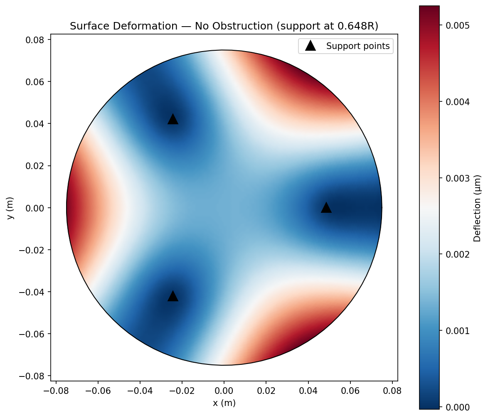
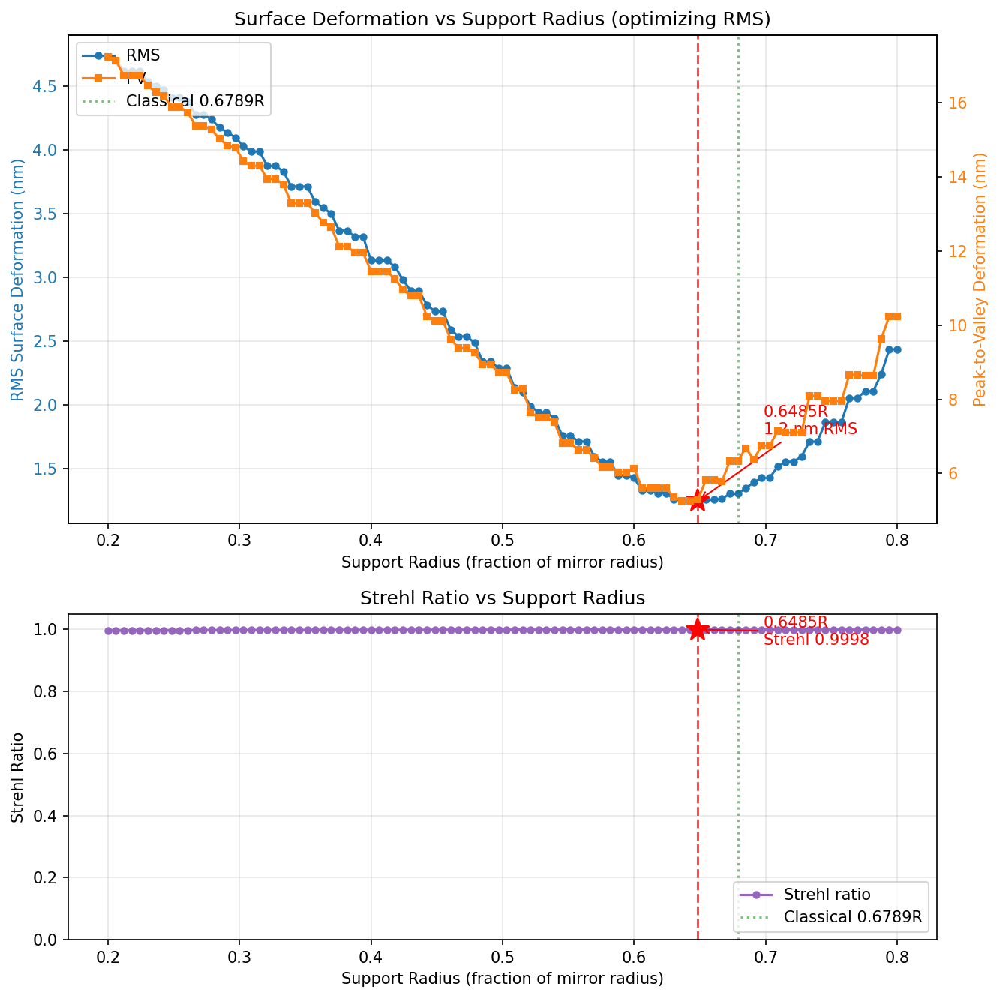
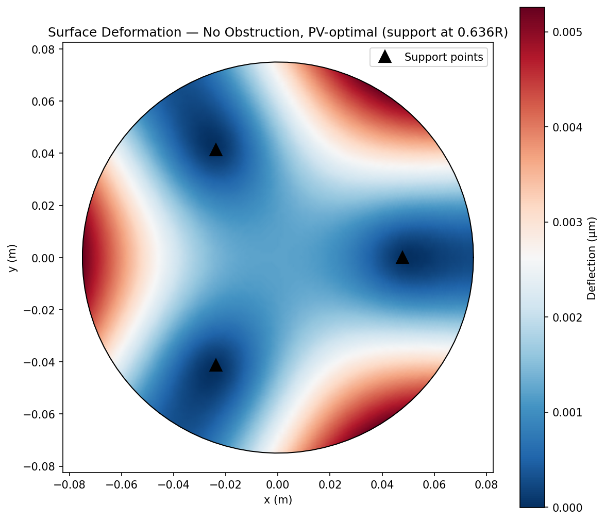
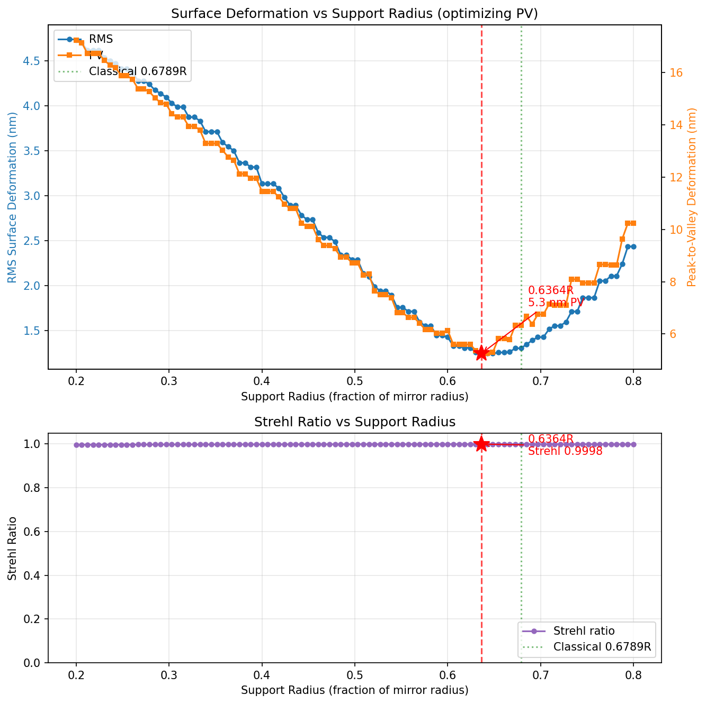
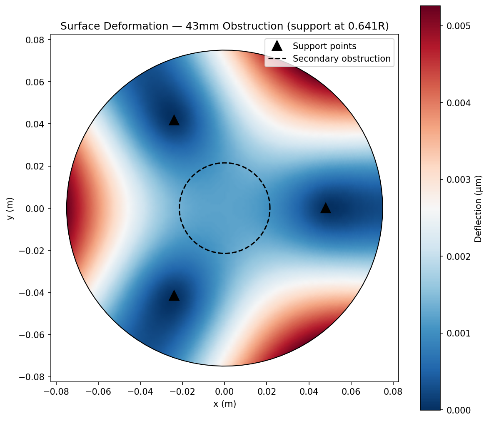
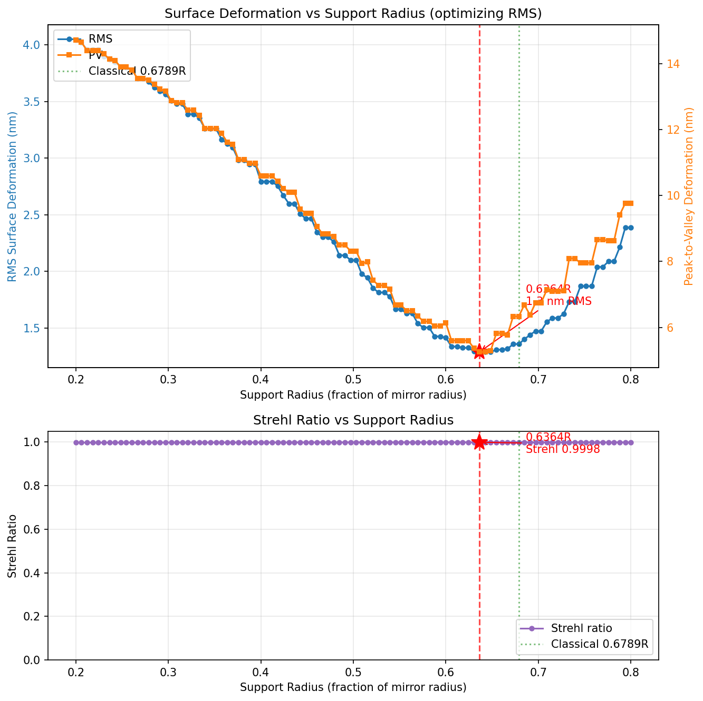
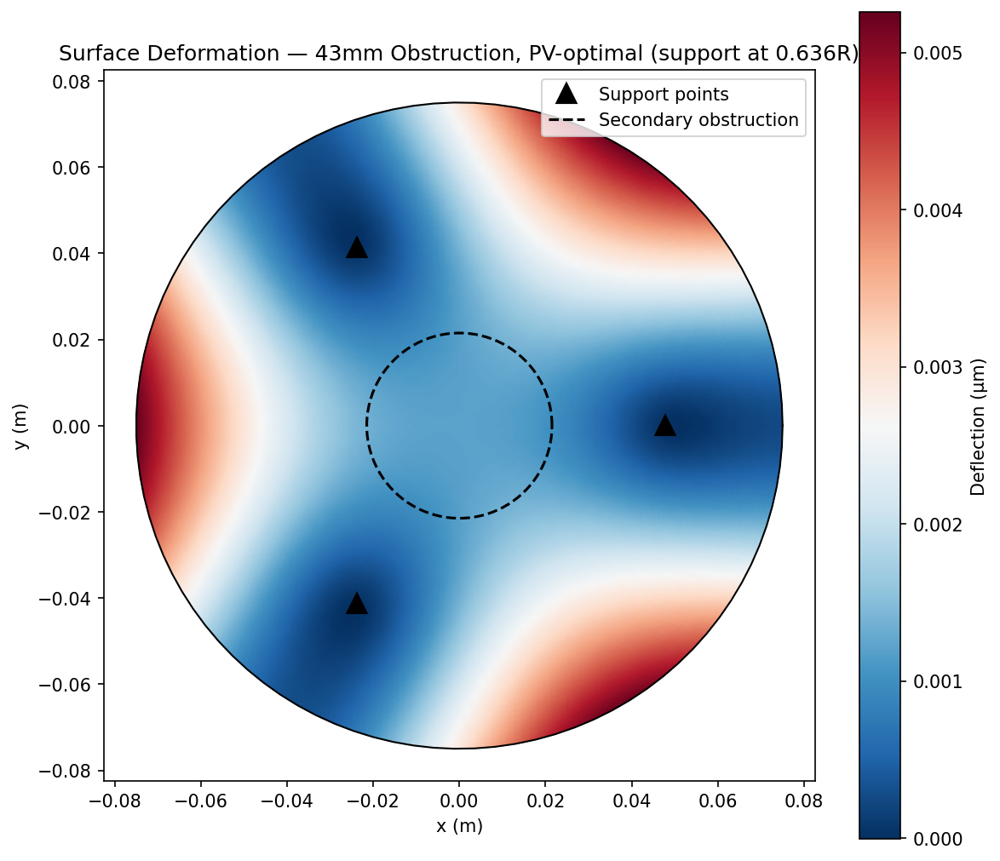
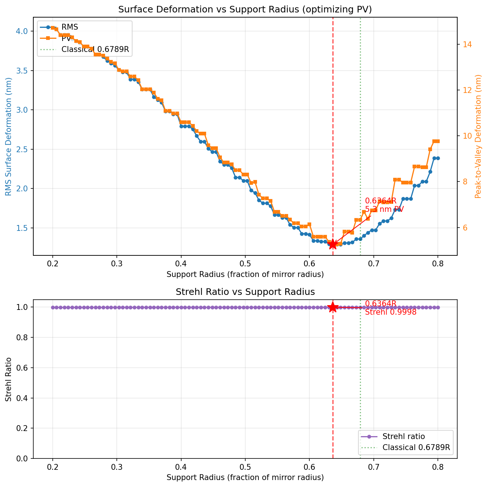
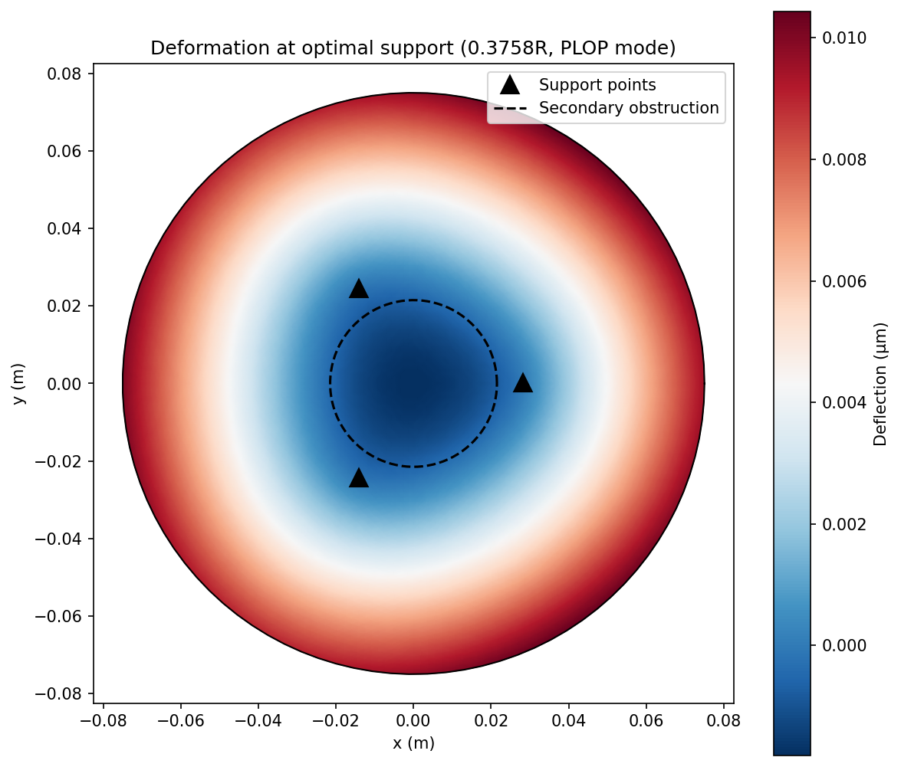
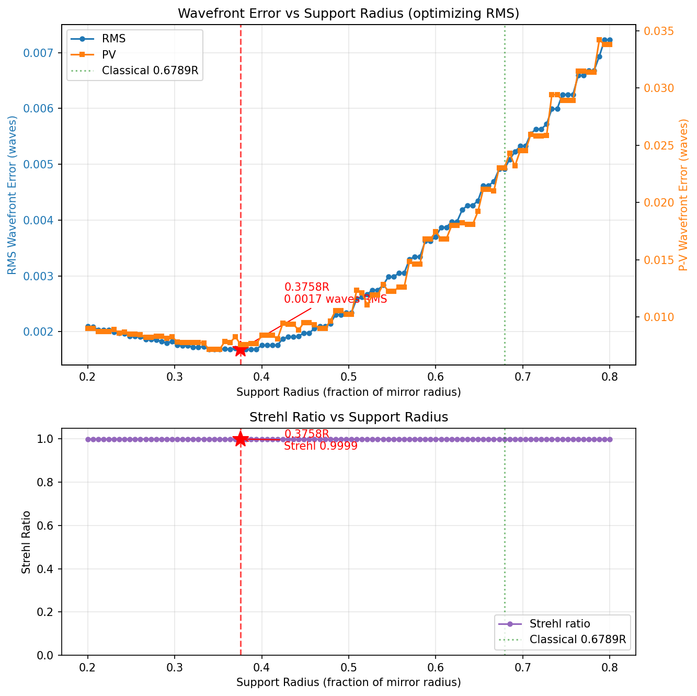

# What's "blip" all about...

I was working on creating a new mirror cell model that could be 3-D printed for the rebuild of my very first telescope,
a 6" Newtonian that I built with my dad back in the 1970s.  The old mirror cell was an cast aluminum, commercially
produced cell, but frankly I found many design elements to be of questionable design: it supported the mirror at three 
positions spaced 120 degrees apart on the circumference.  Traditional wisdom from sites like Stellafane suggested
that 3 point cells would be better supported a sqrt(2)/2 times the mirror radius, to balance the weight on the inside
and outside of the zones.  But I recalled that some other possibilities had been suggested.  Texereau's _How to Make 
A Telescope_, widely considered practically a Bible in the field of amateur telescope making, suggests in section II-3
that small mirrors are "best" supported by three marginal points, advice which probably is sound for the classic
thick blanks that are commonly used.  With the advent of many large and thin mirrors, design of more complex
mirror cells to provide more even support seems reasonable.

An excellent resource is [PLOP](https://github.com/davidlewistoronto/plop), an open source program that can design 
very complex and sophisticated cells, and I would highly recommend it for that purpose.  In theory, it can develop
proper placement for 3 point cells, but I found that while it would generate a design for a 3 point cell, it 
didn't seem to provide the actual radius that I wanted (although graphically it looked much closer, less than half
the radius of the mirror).  I thought the difference was large enough that wanted to find an alternate resource
to verify the result.

I couldn't find one.  So I wrote one. 

Or rather, Claude Code wrote one for me.  Hence, blip was born.  

It is far less versatile than PLOP, and to be fair, doesn't run particularly fast either, but it seems to 
produce results which are close to classic results (the Grubb optimal support radius).  The suggested radius
multiplier is somewhat smaller (0.636 instead of 0.707) but is still nowhere near as low as what appears 
to be suggested by PLOP.   So what gives?  Is PLOP way off?  Or is the classic model not proper?

It appears to be the latter, Using Grok's web search I found this discussion, which seemed to be somewhat helpful. 

[Discussion on Cloudy Nights] (https://www.cloudynights.com/forums/topic/329521-plop-3-point-cell-question/)

While the discussion was not super technical, I began to see what the issues were.   When we optimize
just the overall deviation, the area near the edge is split between high and low zones, meaning that there is a
fairly error (both PV and RMS) in the zone that is most critical to image formation.   This is a reflection 
of the same issues that require consideration of the a tolerance envelope (the [Millies-LaCroix envelope](https://atmsite.udjat.nl/contrib/Poulson/faq/ml.html) as first described in the February 1976 _Sky and Telescope_).   In
particular, slope errors in the mirror surface near the edge are more problematic than similar sized errors
nearer the center.  If the errors were more constant near the edge, it would act as if the telescope's 
focal length were very slightly changed, but that could be accomodated by simply refocusing.

With this idea in mind, I described the situation to Claude and asked them to add a "plop mode" that caused
it to take this into consideration.  And I got precisely what I expected: the optimal radius dropped to less 
than 0.4 times the radius, and the surface deviation was far more radially symmetric, essentially being a 
surface of revolution near the edge. 

= Conclusions

Well, what does this mean for the amateur telescope maker?

Frankly, not a lot.  The truth is that for a full thickness six inch mirror blank, the deviations hardly matter at
all.  The error caused by supports at the sqrt(2)/2 radius is about 5x what they are at the PLOP suggested optimum, but they still account to less than 1/40th of a wave.  Supporting at the edge ala Texereau would still be 1/30th of a wave.
Any of these would be very difficult to discern at the eyepiece.   

But I have a greater understanding of the underlying issues, and I had a lot of fun using Claude to generate
code to help me understand what's going on with mirror cell designs. 

For the purpose of my mirror cell design, I think it proves that I really allowed myself to get distracted, 
and that any choice would have been fine.  Indeed, I feel like if there are physical, mechanical, or even aesthetic
constraints, I now can understand how truly inconsequential they probably will be. 

Hope somebody finds this interesting.


# Mirror Cell Support Optimizer

A free, open-source tool for amateur telescope makers to analyze and optimize the placement of three symmetric support points for a Newtonian telescope primary mirror. It uses finite element analysis to compute gravitational surface deformation and sweeps the support radius to find the placement that minimizes either RMS or peak-to-valley (PV) wavefront error.

## How It Works

The mirror is modeled as a thin circular plate under uniform gravitational loading using Kirchhoff-Love plate bending theory. The governing equation is the biharmonic equation:

```
D * nabla^4(w) = q
```

where `D = E*t^3 / (12*(1-nu^2))` is the flexural rigidity and `q = rho*g*t` is the self-weight pressure.

The FEA uses the **Morley triangle element** via [scikit-fem](https://github.com/kinnala/scikit-fem), a pure-Python finite element library. Three point supports at equal angular spacing (120 degrees apart) are modeled as zero-displacement constraints at the nearest mesh node.

**Key optimization:** The mesh, stiffness matrix K, and load vector f are assembled once. For each candidate support radius in the sweep, only the constraint DOFs change — the system is re-condensed and re-solved. With ~8000 DOFs (nrefs=5), each solve takes milliseconds, making the full sweep fast.

### Modes

The optimizer supports two analysis modes:

- **Standard Mode** (default) — Measures surface deformation in nanometers after removing piston and tilt. This is the physical deflection of the glass.
- **PLOP Mode** (`--mode plop`) — Measures wavefront error at the focus in waves (lambda = 550nm). Surface deformation is doubled (reflection doubles the optical path difference), then piston, tilt, and **defocus** are removed. The defocus removal simulates the observer refocusing the telescope to minimize error at the focal plane, giving a more optically relevant figure of merit. This mimics the approach used by the [PLOP](https://github.com/davidlewistoronto/plop) software.

### Metrics

Two error metrics are computed at every sweep point (in both modes):

- **RMS** — Area-weighted root-mean-square of the error after correction. RMS captures the overall surface quality and correlates directly with the Strehl ratio.
- **PV** (Peak-to-Valley) — Maximum minus minimum error after correction. PV is sensitive to the single worst point on the surface. The classical Grubb result of 0.6789R was derived to minimize this metric.
- **Strehl ratio** — Computed from RMS via the Maréchal approximation: `Strehl = exp(-(2*pi*rms_waves)^2)`. A Strehl ratio above 0.80 is the standard threshold for diffraction-limited performance. The Strehl ratio is printed in the console output and plotted as a second subplot below the RMS/PV curve during optimization.

The `--metric` flag controls which one drives the optimization. All metrics are always reported in the output.

In PLOP mode, the output also includes an optical quality assessment based on the Marechal criterion (diffraction-limited when RMS <= lambda/14).

### Central Obstruction

In a Newtonian telescope the secondary mirror casts a shadow on the primary. Deformations inside this shadow don't contribute to the image. The `--secondary` option excludes nodes inside the secondary's radius from both the piston/tilt fit and the RMS/PV calculations, giving a more realistic measure of optical quality.

## Installation

Requires Python 3.10+.

```bash
pip install -r requirements.txt
```

Dependencies: numpy, scipy, matplotlib, scikit-fem.

## Usage

```
python mirror_cell.py --diameter <mm> --thickness <mm> [options]
```

### Options

| Flag | Description |
|---|---|
| `--diameter` | Primary mirror diameter in mm (required) |
| `--thickness` | Mirror thickness in mm (required) |
| `--secondary` | Secondary mirror diameter in mm (central obstruction) |
| `--mode` | Analysis mode: `standard` (default) or `plop` (wavefront error in waves) |
| `--focal-length` | Mirror focal length in mm (for PLOP mode f-ratio display) |
| `--metric` | Optimization metric: `rms` (default) or `pv` (peak-to-valley) |
| `--support-radius` | Evaluate a single support radius as a fraction of R (0.0-1.0) |
| `--optimize` | Sweep support radius to find the optimum (default if no `--support-radius`) |
| `--n-points` | Number of sweep points (default: 50) |
| `--nrefs` | Mesh refinement level (default: 5, use 6 for higher accuracy) |
| `-o`, `--output` | Save plots to file (format from extension: `.png`, `.pdf`, `.svg`). In optimize mode, two files are saved with `_deformation` and `_metric` suffixes. |
| `--no-plot` | Suppress plot windows |

### Examples

Optimize support placement for a 150mm mirror (RMS, default):

```bash
python mirror_cell.py --diameter 150 --thickness 25 --optimize
```

Optimize for peak-to-valley instead:

```bash
python mirror_cell.py --diameter 150 --thickness 25 --optimize --metric pv
```

With a 43mm secondary obstruction:

```bash
python mirror_cell.py --diameter 150 --thickness 25 --secondary 43 --optimize
```

Evaluate a specific support radius:

```bash
python mirror_cell.py --diameter 150 --thickness 25 --support-radius 0.68
```

Optimize in PLOP mode (wavefront error after refocusing):

```bash
python mirror_cell.py --diameter 150 --thickness 25 --mode plop --focal-length 750
```

PLOP mode with a specific support radius:

```bash
python mirror_cell.py --diameter 150 --thickness 25 --mode plop --support-radius 0.67
```

Save plots to PNG files instead of displaying:

```bash
python mirror_cell.py --diameter 150 --thickness 25 -o results.png
# Produces: results_deformation.png, results_metric.png
```

## Example Results

All examples below use a 150mm diameter, 25mm thick Pyrex mirror with `--nrefs 6 --n-points 100` for higher accuracy.

---

### 1. No obstruction, optimizing RMS (default)

```
Optimizing:       RMS
Optimal support radius: 0.6485R = 48.64 mm
  RMS at optimum: 1.24 nm
  PV  at optimum: 5.29 nm
  Strehl ratio:   0.9998
```



The deformation map shows the characteristic three-fold symmetric pattern. The mirror sags between the support points (red) and lifts near the supports and at the center (blue).



The top panel plots RMS (blue, left axis) and PV (orange, right axis) simultaneously. The red dashed line marks the RMS optimum at 0.6485R. The green dotted line shows the classical Grubb reference at 0.6789R. The bottom panel shows the corresponding Strehl ratio — essentially 1.0 across the full range for a mirror this small, confirming that three-point support is more than adequate.

---

### 2. No obstruction, optimizing PV

```
Optimizing:       Peak-to-Valley
Optimal support radius: 0.6364R = 47.73 mm
  RMS at optimum: 1.25 nm
  PV  at optimum: 5.25 nm
  Strehl ratio:   0.9998
```





The PV-optimal radius (0.6364R) is slightly smaller than the RMS-optimal (0.6485R). The PV curve has a broader, flatter minimum than RMS, making it less sensitive to exact placement near the optimum. The Strehl subplot confirms near-perfect optical quality across the full sweep range.

---

### 3. With 43mm obstruction, optimizing RMS

```
Secondary diam:   43.0 mm (central obstruction)
  Obstruction:    28.7% by diameter
Optimizing:       RMS
Optimal support radius: 0.6364R = 47.73 mm
  RMS at optimum: 1.29 nm
  PV  at optimum: 5.25 nm
  Strehl ratio:   0.9998
```



The deformation pattern is physically identical — the glass deforms the same way regardless of the secondary shadow. The dashed circle marks the 43mm obstruction boundary; deformations inside it are excluded from RMS/PV calculations.



---

### 4. With 43mm obstruction, optimizing PV

```
Optimizing:       Peak-to-Valley
Optimal support radius: 0.6364R = 47.73 mm
  RMS at optimum: 1.29 nm
  PV  at optimum: 5.25 nm
  Strehl ratio:   0.9998
```





---

### 5. PLOP Mode — 150mm f/6 mirror with 43mm obstruction

```bash
python mirror_cell.py --diameter 150 --thickness 25 --secondary 43 --mode plop --focal-length 900 --nrefs 6 --n-points 100
```

```
Mode:             PLOP (wavefront error)
Mirror diameter:  150.0 mm
Mirror radius:    75.0 mm
Mirror thickness: 25.0 mm
Focal length:     900.0 mm (f/6.0)
Secondary diam:   43.0 mm (central obstruction)
  Obstruction:    28.7% by diameter
Wavelength:       550 nm (reference)
Refocusing:       enabled (defocus term removed)
Optimizing:       RMS

Optimal support radius: 0.3758R = 28.18 mm
  RMS wavefront error at optimum: 0.0017 waves (0.0004 Rayleigh)
  P-V wavefront error at optimum: 0.0076 waves
  Strehl ratio at optimum:        0.9999
  Optical quality: Diffraction-limited (Marechal criterion: RMS <= lambda/14)

Classical reference (Grubb, PV-optimal): 0.6789R
Deviation from classical PV-optimal:     44.7%
```



The support points (black triangles) sit well inside the mirror — at 0.376R rather than the classical 0.679R. The deformation pattern still shows three-fold symmetry, but the supports are now closer to balancing the higher-order wavefront residuals that remain after refocusing.



The top panel shows RMS and P-V wavefront error (in waves at 550nm) increasing steeply toward the mirror edge. The broad, flat minimum around 0.3-0.4R contrasts sharply with the Standard mode optimum near 0.64R. The classical Grubb reference (green dotted line at 0.6789R) falls in a region where wavefront error is roughly 3x higher than the PLOP optimum. The bottom panel shows the Strehl ratio remains essentially 1.0 near the optimum, dropping only at the extreme edges of the sweep range.

In PLOP mode the optimizer removes piston, tilt, **and defocus** from the wavefront (simulating the observer refocusing the telescope). This absorbs the dominant parabolic sag, so the remaining higher-order residuals are minimized at a much smaller support radius (~0.38R) compared to Standard mode (~0.64R). The wavefront error is extremely small — well within diffraction-limited quality — confirming that three-point support is more than adequate for a mirror of this size.

This matches the behavior seen in the [PLOP](https://github.com/davidlewistoronto/plop) software, which also tends to recommend support radii significantly inside the classical Grubb value when optimizing wavefront error after refocusing.

---

### Summary comparison

| Configuration | Metric | Optimal r/R | RMS (nm) | PV (nm) | Strehl |
|---|---|---|---|---|---|
| No obstruction | RMS | 0.6485 | 1.24 | 5.29 | 0.9998 |
| No obstruction | PV | 0.6364 | 1.25 | 5.25 | 0.9998 |
| 43mm obstruction | RMS | 0.6364 | 1.29 | 5.25 | 0.9998 |
| 43mm obstruction | PV | 0.6364 | 1.29 | 5.25 | 0.9998 |

| Configuration | Mode | Optimal r/R | RMS (waves) | PV (waves) | Strehl |
|---|---|---|---|---|---|
| 43mm obstruction | PLOP (RMS) | 0.3758 | 0.0017 | 0.0076 | 0.9999 |

Key observations:

- **RMS vs PV optimum:** Without obstruction, the RMS-optimal radius (0.649R) is slightly larger than the PV-optimal (0.636R). The difference is small (~1% of mirror radius) and both are near the classical 0.6789R.
- **Effect of obstruction on RMS:** Excluding the central zone raises the minimum RMS slightly (1.24 to 1.29 nm) because the well-behaved central nodes that were pulling the average down are now excluded.
- **Effect of obstruction on PV:** PV is unchanged at 5.25 nm — the peak and valley both occur in the outer annulus, outside the obstruction.
- **Optimal radius shifts inward with obstruction:** The RMS optimum moves from 0.649R to 0.636R because the piston/tilt fit, now computed only over the outer annulus, changes the residual shape that RMS measures.
- **Flat minimum:** The minimum is broad in all cases, meaning placement errors of a few percent have minimal impact on optical quality.

## File Structure

```
mirror_cell.py    — CLI entry point, argument parsing, output formatting
plate_fem.py      — FEA engine: mesh, stiffness/load assembly, support constraints, solve
rms_calc.py       — Surface error metrics (RMS, PV) with piston/tilt removal and obstruction masking
optimizer.py      — Support radius sweep (reuses single K/f assembly)
visualize.py      — Matplotlib: deformation map, dual-axis metric-vs-radius curve with Strehl subplot
requirements.txt  — Python dependencies
```

## Material Properties

Default material is Pyrex (borosilicate glass):

| Property | Value |
|---|---|
| Young's modulus (E) | 63 GPa |
| Poisson's ratio (nu) | 0.20 |
| Density (rho) | 2230 kg/m^3 |

## Notes

- The mesh is generated from `MeshTri.init_circle()` and scaled to the mirror radius. Support points snap to the nearest mesh node, which introduces small quantization steps visible in the sweep curves. Use `--nrefs 6` for finer resolution (at the cost of ~4x more DOFs and longer solve times).
- The classical Grubb optimal radius of 0.6789R was derived analytically for a uniformly loaded thin plate. The FEA results (~0.64-0.65R) are close but not identical, partly due to mesh discretization and partly because the analytical derivation uses different assumptions about the piston/tilt reference.
- Deflections for typical amateur mirrors (150-300mm) are on the order of nanometers — far below the wavelength of visible light (~550 nm). Three-point support is adequate for mirrors up to roughly 300mm; larger mirrors typically need more support points.
